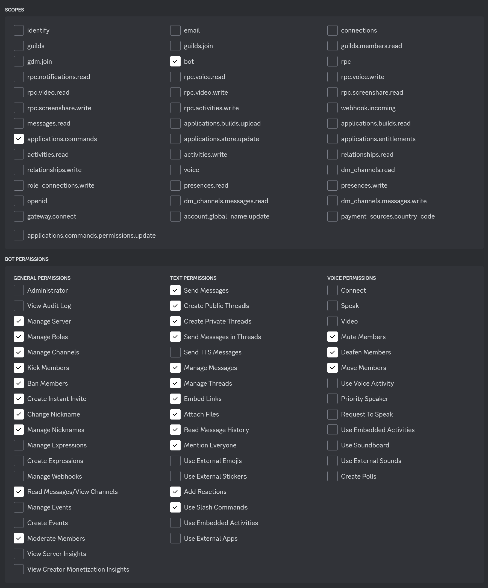

<p align="center">
    
    <h1 align="center">Sodium</h1>
    <h4 align="center">Open source discord bot with application commands and a user-friendly interface</h4>
</p>

<p align="center">
    <a href="https://github.com/yewshanooi/sodium/releases/">
        
    </a>
  &nbsp;
    <a href="https://github.com/yewshanooi/sodium/">
        
    </a>
  &nbsp;
    <a href="https://github.com/yewshanooi/sodium/commits/">
        
    </a>
  &nbsp;
    <a href="https://www.codefactor.io/repository/github/yewshanooi/sodium/">
        
    </a>
</p>
<br/>

## Features
- **Application Commands**, **Buttons**, and **Message Embed**
- **AI Chatbot** *(powered by Google)*
- **Moderation Logs** *(stored using MongoDB)*
- **Third Party API** commands *(such as Giphy, Nasa, Wikipedia and more!)*
- **Watch Together** *(with YouTube Activity)*
<br/>

## Commands
<table>
  <tr>
    <td><b>Fun</b></td>
    <td><b>Moderation</b></td>
    <td><b>Utility</b></td>
  </tr>
  <tr>
    <td>8ball, achievement, beep, coinflip, color, compliment, diceroll, fact <b>[cat | dog | general | useless]</b>, fortnite, giphy, hypixel, leagueoflegends, lyrics, meme, minecraft, nasa, pokemon, rps, say, spotify, urban, waifu, word, youtube</td>
    <td>ban, channel <b>[delete | lock | rename | unlock]</b>, deafen, kick, logs <b>[add | initialize | remove | view]</b>, purge, role <b>[add | remove]</b>, setnick, slowmode, timeout, unban, undeafen, untimeout, warn</td>
    <td>afk, announce, botpresence, botsetnick, calculator, crypto, dictionary, gemini, github, guildrename, help, info <b>[channel | client | guild | role | user]</b>, invite, leave, message, news, npm, ping, qrcode, thread, weather, wikipedia</td>
  </tr>
</table>
<br/>

## Dependencies
###### Node.js
Node.js version **≥20.15.0** is required

###### npm Packages
<table>
  <tr>
    <td><a href="https://www.npmjs.com/package/@google/generative-ai">@google/generative-ai@0.16.0</a></td>
    <td><a href="https://www.npmjs.com/package/chalk">chalk@4.1.2</a></td>
  </tr>
  <tr>
    <td><a href="https://www.npmjs.com/package/discord.js">discord.js@14.15.3</a></td>
    <td><a href="https://www.npmjs.com/package/dotenv">dotenv@16.4.5</a></td>
  </tr>
  <tr>
    <td><a href="https://www.npmjs.com/package/eslint">eslint@9.7.0</a></td>
    <td><a href="https://www.npmjs.com/package/mathjs">mathjs@13.0.3</a></td>
  </tr>
  <tr>
    <td><a href="https://www.npmjs.com/package/mongodb">mongodb@6.8.0</a></td>
    <td><a href="https://www.npmjs.com/package/mongoose">mongoose@8.5.1</a></td>
  </td>
  <tr>
    <td><a href="https://www.npmjs.com/package/node-fetch">node-fetch@2.7.0</a></td>
    <td></td>
  </td>
</table>
<br/>

## Guide
###### Configuration Files
1. **Clone** this repository to your local drive
```sh
git clone https://github.com/yewshanooi/sodium.git
cd sodium
```
2. Install the required **npm packages**
```
npm install
```
3. Install the **nodemon** npm package globally
> [!NOTE]
> Ignore this step if you already have nodemon installed
```
npm install -g nodemon
```
4. Create a new file named **config.json** and fill it with your own information<br/>
> [!WARNING]
> The embedColor field is required
```
{
  "embedColor": ""
}
```
5. Create a new file named **.env** and fill it with your own variables<br/>
> [!WARNING]
> The TOKEN, MONGODB_TOKEN, CLIENT_ID, and GUILD_ID fields are required, while the rest are optional. With missing fields, certain features might not work as intended
```
TOKEN=
MONGODB_TOKEN=
CLIENT_ID=
GUILD_ID=
DEBUG_CHANNEL_ID=
ERROR_CHANNEL_ID=
WARNING_CHANNEL_ID=
FORTNITE_API_KEY=
GENIUS_API_KEY=
GIPHY_API_KEY=
GOOGLE_API_KEY=
HYPIXEL_API_KEY=
NASA_API_KEY=
NEWS_API_KEY=
OPENWEATHERMAP_API_KEY=
RIOTGAMES_API_KEY=
```
6. Run the **commands.js** file to deploy or delete application commands<br/>
> [!IMPORTANT]
> Commands are only deployed or deleted for a single guild by default. You can deploy all commands or a single command, but you can only delete all commands
```
node commands.js deploy    -or-    node commands.js deploy {command}
```
```
node commands.js delete
```
7. Run the **index.js** file to start the bot<br/>
> [!WARNING] 
> Don't forget to deploy commands before starting the bot, otherwise commands won't appear as they are not updated
```
node index.js    -or-    npm start    -or-    nodemon
```

###### Bot & Application
1. Visit [Discord Developer Portal](https://discord.com/developers/applications) to create a new application

2. In Installation tab, enable `Guild Install` option under Authorization Methods

3. In Bot tab, enable `Presence Intent` and `Server Members Intent` options under Privileged Gateway Intents

4. Paste this OAuth2 URL template in your browser's address bar and replace `{CLIENT_ID}` with your **Client ID** to invite the bot to your guild
```url
https://discord.com/oauth2/authorize?client_id={CLIENT_ID}&permissions=1497295481975&integration_type=0&scope=bot+applications.commands
```

###### OAuth2 URL Scopes & Bot Permissions
<p align="left">
    
</p>
<br/>

## License
This application is licensed under the **MIT License**
```
THE SOFTWARE IS PROVIDED "AS IS", WITHOUT WARRANTY OF ANY KIND, EXPRESS OR IMPLIED, 
INCLUDING BUT NOT LIMITED TO THE WARRANTIES OF MERCHANTABILITY, FITNESS FOR A PARTICULAR PURPOSE AND NONINFRINGEMENT. 
IN NO EVENT SHALL THE AUTHORS OR COPYRIGHT HOLDERS BE LIABLE FOR ANY CLAIM, DAMAGES OR OTHER LIABILITY, 
WHETHER IN AN ACTION OF CONTRACT, TORT OR OTHERWISE, ARISING FROM, OUT OF OR IN CONNECTION WITH THE SOFTWARE OR 
THE USE OR OTHER DEALINGS IN THE SOFTWARE.
```
<br/>

## Contributors
- [yewshanooi](https://github.com/yewshanooi)
- [Manzanitabot123](https://github.com/Manzanitabot123)
