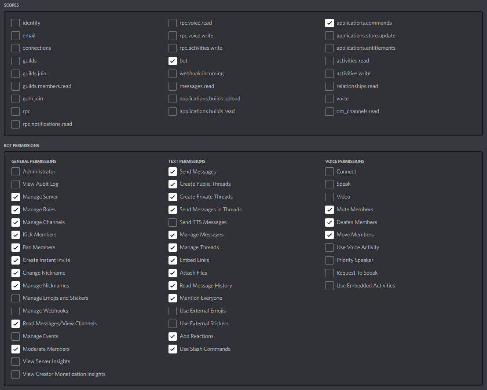

<p align="center">
    
    <h1 align="center">Ava</h1>
    <h4 align="center">Open source discord bot with application commands and a user-friendly interface</h4>
</p>

<p align="center">
    <a href="https://github.com/yewshanooi/ava/releases/">
        
    </a>
  &nbsp;
    <a href="https://github.com/yewshanooi/ava/">
        
    </a>
  &nbsp;
    <a href="https://github.com/yewshanooi/ava/blob/main/LICENSE">
        
    </a>
  &nbsp;
    <a href="https://www.codefactor.io/repository/github/yewshanooi/ava/">
        
    </a>
  &nbsp;
    <a href="https://github.com/yewshanooi/ava/commits/">
        
    </a>
</p>

## Features
- **Message Embed** and **Buttons**
- **Application Commands** *(formerly known as Slash Commands)*
- **Watch Together** *(with YouTube Activity)*
- **Third Party API** commands *(such as Giphy, Nasa, OpenWeatherMap and more!)*

## Commands
<table>
  <tr>
    <td><b>Fun</b></td>
    <td><b>Moderation</b></td>
    <td><b>Utility</b></td>
  </tr>
  <tr>
    <td>8ball, achievement, beep, catfact, chatbot, coinflip, color, compliment, crypto, diceroll, dictionary, dogfact, fact, fortnite, giphy, github, lyrics, meme, minecraft, nasa, npm, roast, rps, say, spotify, urban, uselessfact, waifu, weather, wikipedia, word, youtube</td>
    <td>ban, channellock, channelunlock, deafen, kick, slowmode, timeout, unban, undeafen, untimeout, warn</td>
    <td>afk, announce, botinfo, botpresence, botsetnick, calculator, channeldelete, channelinfo, channelrename, guildinfo, guildname, help, invite, leave, message, news, ping, purge, roleadd, roleinfo, roleremove, setnick, thread, threadarchive, userinfo</td>
  </tr>
</table>

## Dependencies
###### Node.js
Node.js version **≥16.9.0** is required

###### Packages
<table>
  <tr>
    <td><a href="https://www.npmjs.com/package/chalk">chalk@4.1.2</a></td>
    <td><a href="https://www.npmjs.com/package/eslint">eslint@8.24.0</a></td>
  </tr>
  <tr>
    <td><a href="https://www.npmjs.com/package/discord-api-types">discord-api-types@0.37.10</a></td>
    <td><a href="https://www.npmjs.com/package/mathjs">mathjs@11.2.1</a></td>
  </tr>
  <tr>
    <td><a href="https://www.npmjs.com/package/discord.js">discord.js@14.4.0</a></td>
    <td><a href="https://www.npmjs.com/package/node-fetch">node-fetch@2.6.7</a></td>
  </tr>
  <tr>
    <td><a href="https://www.npmjs.com/package/dotenv">dotenv@16.0.2</a></td>
    <td><a href="https://www.npmjs.com/package/nodemon">nodemon@2.0.20</a></td>
  </tr>
</table>

## Guide
###### Configuration Files
1. **Clone** this repository to your local drive
```sh
git clone https://github.com/yewshanooi/ava.git
cd ava
```
2. Install the required **npm packages**
```
npm install
```
3. Create a new **config.json** file and fill it with your preferred information<br/>
💡 ***embedColor** is required while the rest is optional*
```json
{
  "embedColor": "",
  "debugChannelId": "",
  "errorChannelId": "",
  "warningChannelId": ""
}
```
4. Create a new **.env** file and fill it with your own secret keys
```
TOKEN=
CLIENT_ID=
BRAINSHOP_BID=
BRAINSHOP_API_KEY=
FORTNITE_API_KEY=
GIPHY_API_KEY=
GENIUS_API_KEY=
NASA_API_KEY=
NEWS_API_KEY=
OPENWEATHERMAP_API_KEY=
```
5. Run the **deploy.js** file to deploy application commands
```
node deploy.js
```
6. Run the **index.js** file to start the bot
```
node index.js
 -or-
nodemon
```
💡 *Don't forget to run **deploy.js** file before **index.js** file, otherwise commands won't appear as they are not updated*

###### Bot & Application
1. Visit [Discord Developer Portal](https://discord.com/developers/applications) to create a new application

2. Add a **bot user** to your application

3. Enable `PUBLIC BOT` authorization flow option for the application **(OPTIONAL)**

4. Enable `PRESENCE INTENT` and `SERVER MEMBERS INTENT` privileged gateway intent option for the application **(REQUIRED)**

5. Replace this **OAuth2 URL** template with your **Client ID** and paste it in your browser to invite the application to your server
```url
https://discord.com/api/oauth2/authorize?client_id={CLIENT_ID}&permissions=1497295481975&scope=bot%20applications.commands
```

###### OAuth2 URL Scopes & Permissions
<p align="left">
    
</p>

## License
This application is licensed under the **MIT License**
```
THE SOFTWARE IS PROVIDED "AS IS", WITHOUT WARRANTY OF ANY KIND, EXPRESS OR IMPLIED, 
INCLUDING BUT NOT LIMITED TO THE WARRANTIES OF MERCHANTABILITY, FITNESS FOR A PARTICULAR PURPOSE AND NONINFRINGEMENT. 
IN NO EVENT SHALL THE AUTHORS OR COPYRIGHT HOLDERS BE LIABLE FOR ANY CLAIM, DAMAGES OR OTHER LIABILITY, 
WHETHER IN AN ACTION OF CONTRACT, TORT OR OTHERWISE, ARISING FROM, OUT OF OR IN CONNECTION WITH THE SOFTWARE OR 
THE USE OR OTHER DEALINGS IN THE SOFTWARE.
```

## Contributors
- [yewshanooi](https://github.com/yewshanooi)
- [Manzanitabot123](https://github.com/Manzanitabot123)
